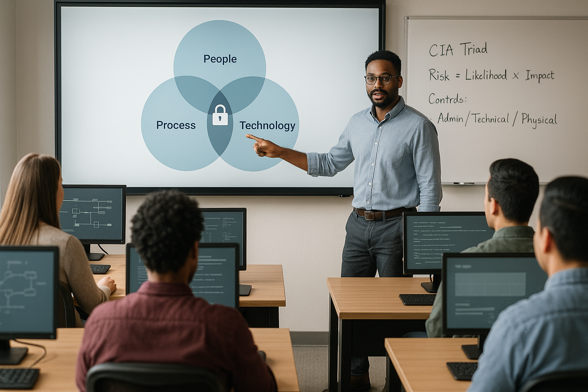

# Welcome & Framing

## Today’s goal
You are going to learn the core ideas behind cybersecurity in a way that helps you make good decisions—not just memorize terms.

## What you will be able to do by the end of Day 1

- Explain what cybersecurity is (and what it is not)
- Use the **CIA Triad** to think clearly about security problems
- Use a simple **risk** model to prioritize what to do first
- Identify **threats**, **vulnerabilities**, and **controls**
- Explain beginner-level security concepts in networking, the web, and identity
- Describe why logging and incident response matter

## How we will learn

- Short lessons with examples
- Hands-on activities and small labs
- Lots of “think like a defender” practice

## Ground rules

- Ask questions early.
- It is normal not to know the jargon—focus on the ideas.
- We will use real-world examples. Keep discussions respectful and practical.

## Warm-up (3 minutes)
In one sentence:

- What does “cybersecurity” mean to you right now?
