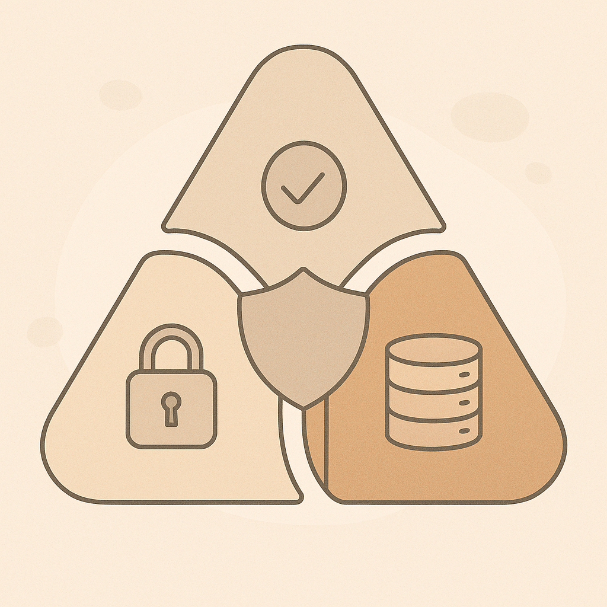

# The CIA Triad

## What you will learn
You will use the CIA Triad to describe *what kind* of security problem you are dealing with.

## CIA stands for
### Confidentiality
Keeping information private—only the right people can access it.

Examples:

- Passwords
- Student records
- Private messages

### Integrity
Keeping information accurate and unmodified by unauthorized changes.

Examples:

- Grades
- Bank balances
- System configuration files

### Availability
Keeping systems and information accessible when they are needed.

Examples:

- Email and internet access
- A school’s learning platform
- A point-of-sale system

## Important note
Many real incidents affect more than one part of CIA.

## Quick practice (5 minutes)
For each scenario, decide whether it is mainly C, I, A—or a mix:

1. A stolen laptop with unencrypted files.
2. A student changes a grade in the system without permission.
3. A website goes offline during registration day.
