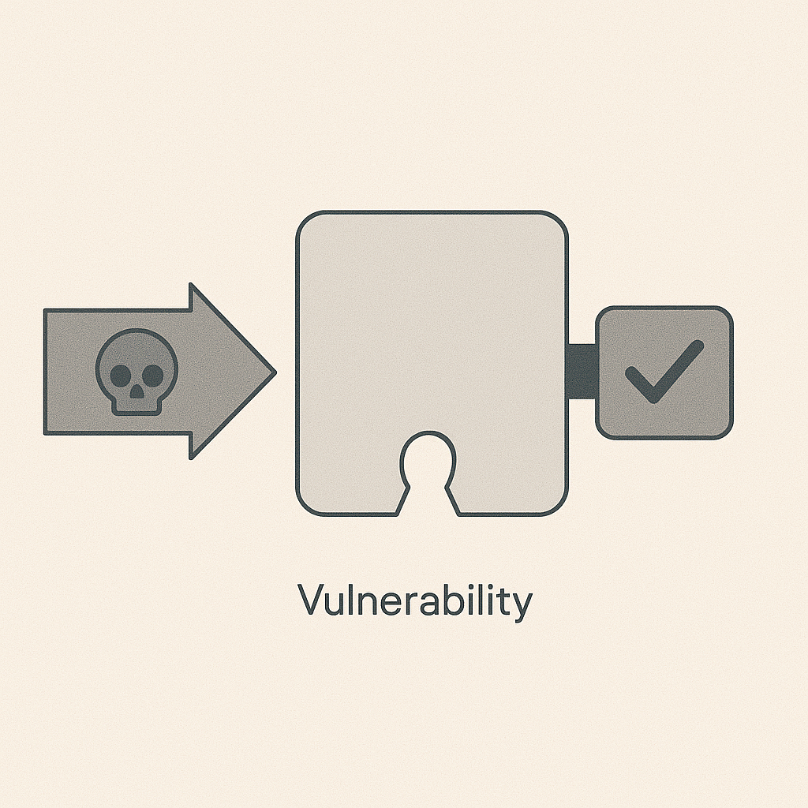

# Threats, Vulnerabilities, Controls

## Definitions

- **Threat**: something that can cause harm (a person, group, or event)
- **Vulnerability**: a weakness that could be exploited
- **Control**: something that reduces likelihood and/or impact

## Examples
### Example 1

- Threat: Phishing campaign targeting employees
- Vulnerability: People click links and enter passwords
- Control: MFA + training + email filtering

### Example 2

- Threat: Malware infection via USB drive
- Vulnerability: Unknown USB devices allowed
- Control: Device policy + endpoint protection + least privilege

## Types of controls

- **Administrative**: policies, training, procedures
- **Technical**: MFA, patching, logging, antivirus/EDR
- **Physical**: locks, badges, secured rooms

## Activity (15 minutes)
Pick a real environment you know (school lab, small business, home network).

Write:

- 3 assets:
- 2 threats:
- 2 vulnerabilities:
- 3 controls (at least one administrative and one technical):
