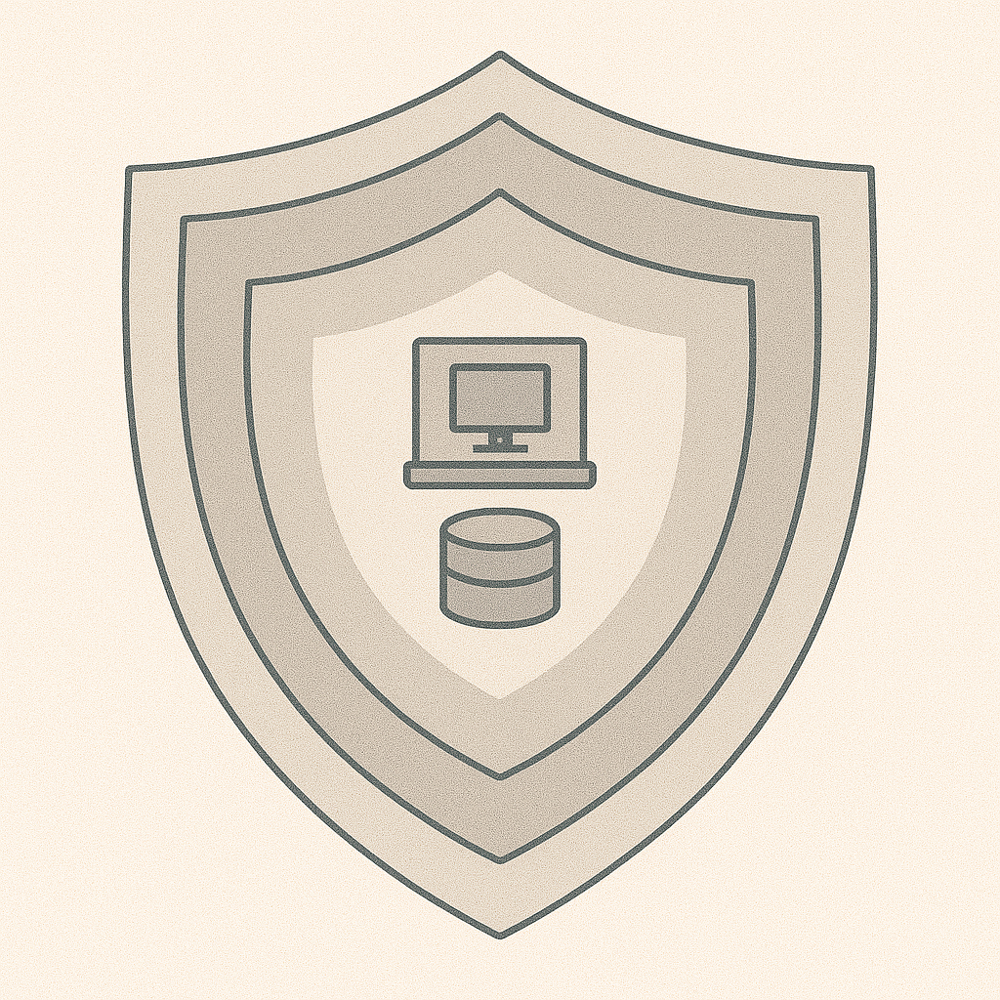

# Protecting Systems and Data

## Big idea
Good security is layered. You want multiple ways to prevent, detect, and respond.

## A simple “layered defense” view
### Prevent

- MFA
- Patching
- Least privilege
- Email filtering
- Safe defaults

### Detect

- Logs (login events, system alerts)
- Antivirus/EDR alerts
- Unusual behavior (multiple failed logins, strange location logins)

### Respond

- Clear steps for incidents
- Backups and recovery plans
- Communication plan

## Quick activity (8 minutes)
Choose one threat:

- Phishing
- Ransomware
- Stolen device
- Unauthorized access

Write one control for:

- Prevent:
- Detect:
- Respond:
