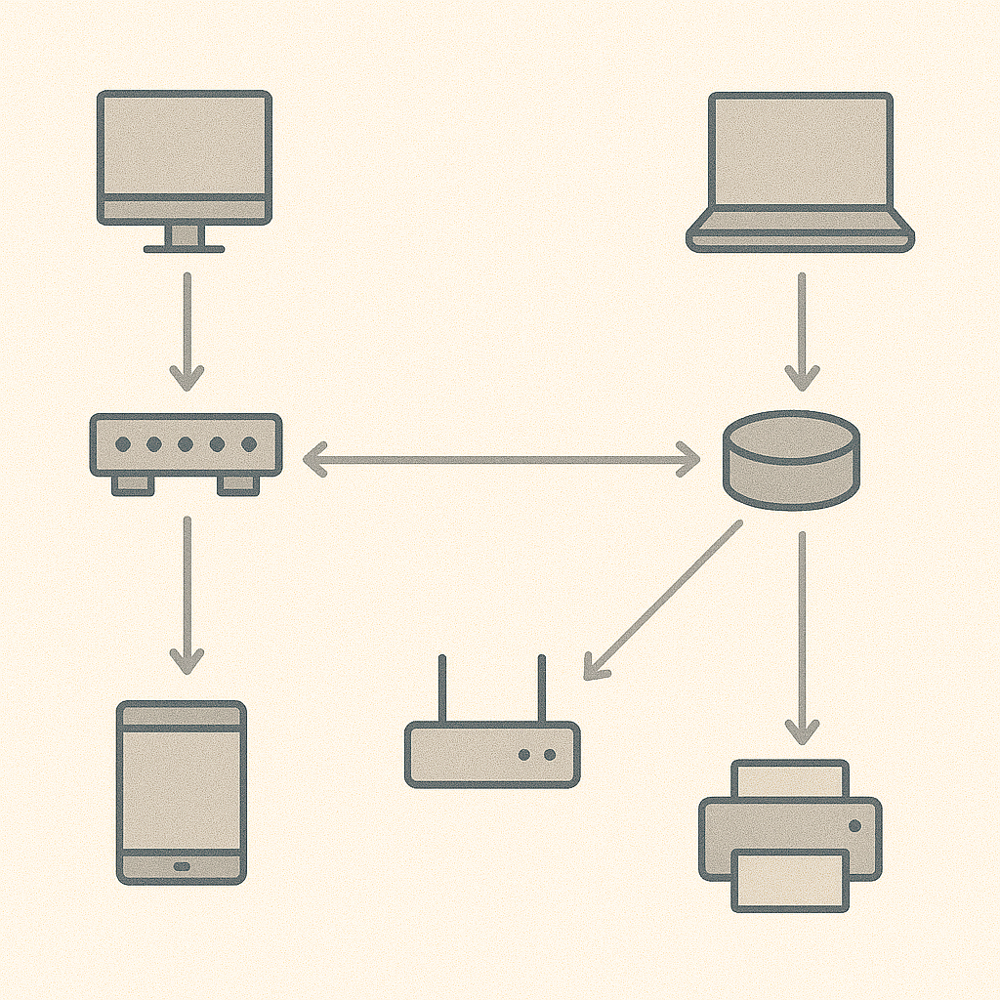
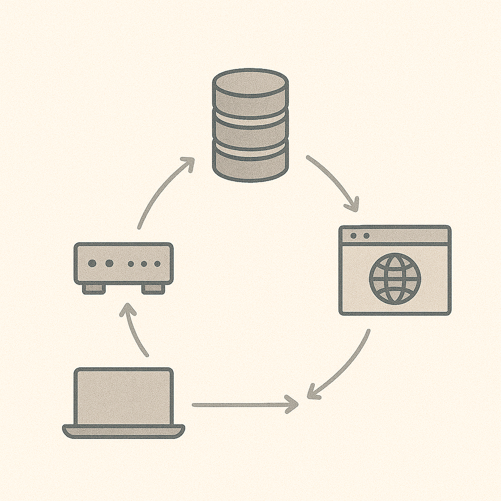

# Networking Basics for Cyber

## Why networking matters
Many attacks and outages are really networking problems (or look like them). You do not need to be a network engineer—but you do need the basics.

## Core concepts

- **IP address**: identifies a device on a network
- **Port**: identifies a service on that device (like a door)
- **Protocol**: rules for communication (TCP, UDP, HTTP, DNS)

## DNS (names to addresses)
DNS turns names (like `example.com`) into IP addresses.

If DNS is wrong or compromised:

- you may go to the wrong site
- security tools may not work correctly

## Quick check (3 minutes)

1. What does port 443 usually mean?
2. Why would attackers care about DNS?
