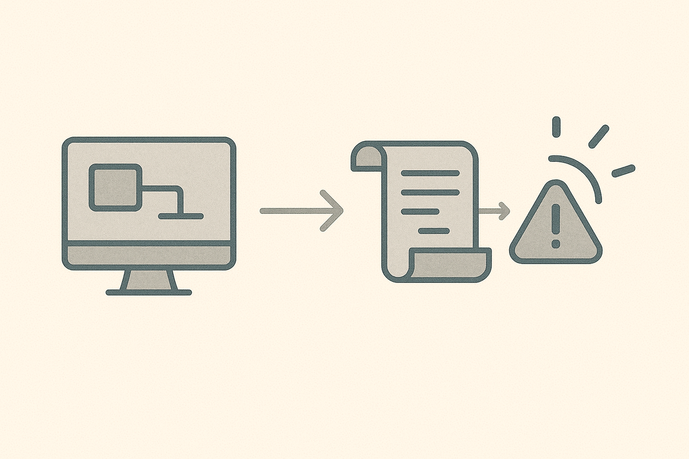

# Logging & Detection Basics

## What is a log?
A log is a record of events. Logs help you answer:

- What happened?
- When did it happen?
- Which account/device did it involve?

## Why logs matter
Without logs, incidents turn into guessing.

## High-value logs (starter list)

- Login successes and failures
- MFA events (enabled, challenged, failed)
- Endpoint security alerts
- Admin actions on key systems
- Server/service errors on important systems

## Activity (8 minutes)
Imagine someone stole an account password.

What evidence would you want to see?

- Evidence 1:
- Evidence 2:
- Evidence 3:

Which logs might contain that evidence?

- Log source 1:
- Log source 2:
