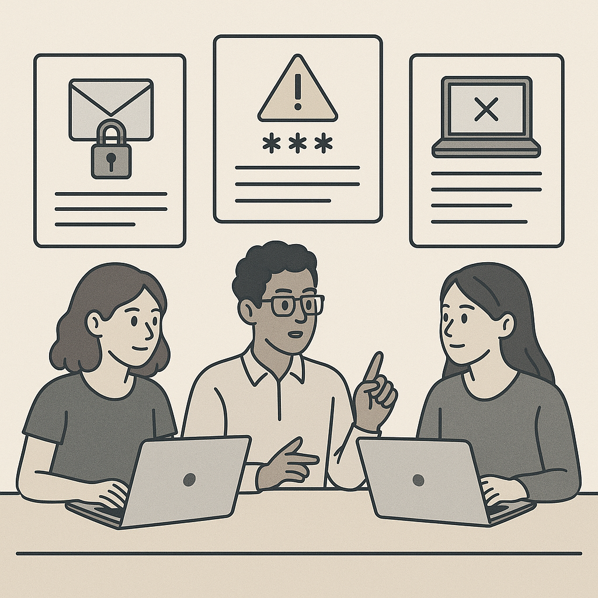

# Lab 1 — CIA Triad in Action

## Before you begin
You must have the Lab Hub running.

Complete this first:
[Lab Environment Setup](/workshops/cyber-for-beginners/labs/setup/)

Then, in the Lab Hub, launch:
**Lab 1 — CIA Triad Scenario Matcher** (Start → Launch)

---

## Objective
Use the CIA Triad to analyze scenarios and explain your reasoning.

## Instructions
Work in pairs or small groups. For each scenario:

1. Identify the **primary** CIA component impacted (**Confidentiality**, **Integrity**, or **Availability**)
2. Identify any **secondary** CIA impacts
3. Propose **one reasonable control** that could reduce risk

## Scenarios
1. A teacher’s laptop containing unencrypted student grades is stolen.
2. A ransomware attack encrypts a department file server for four days.
3. A shared lab manual is altered to include incorrect commands.
4. Campus Wi-Fi fails during an online exam window.
5. An HR spreadsheet containing sensitive data is emailed to the wrong group.

## Discussion questions
- Why might multiple CIA components apply in the same incident?
- Which incidents cause the most operational impact? Why?
- What evidence would indicate each incident occurred?

## What to turn in
For **three** of the scenarios, write:

- Primary CIA component:
- Secondary CIA component(s):
- One control (and why it helps):

## If you finish early
Choose one scenario and answer:

- What log sources would help confirm the incident?
- What would a good “first 15 minutes” response look like?
