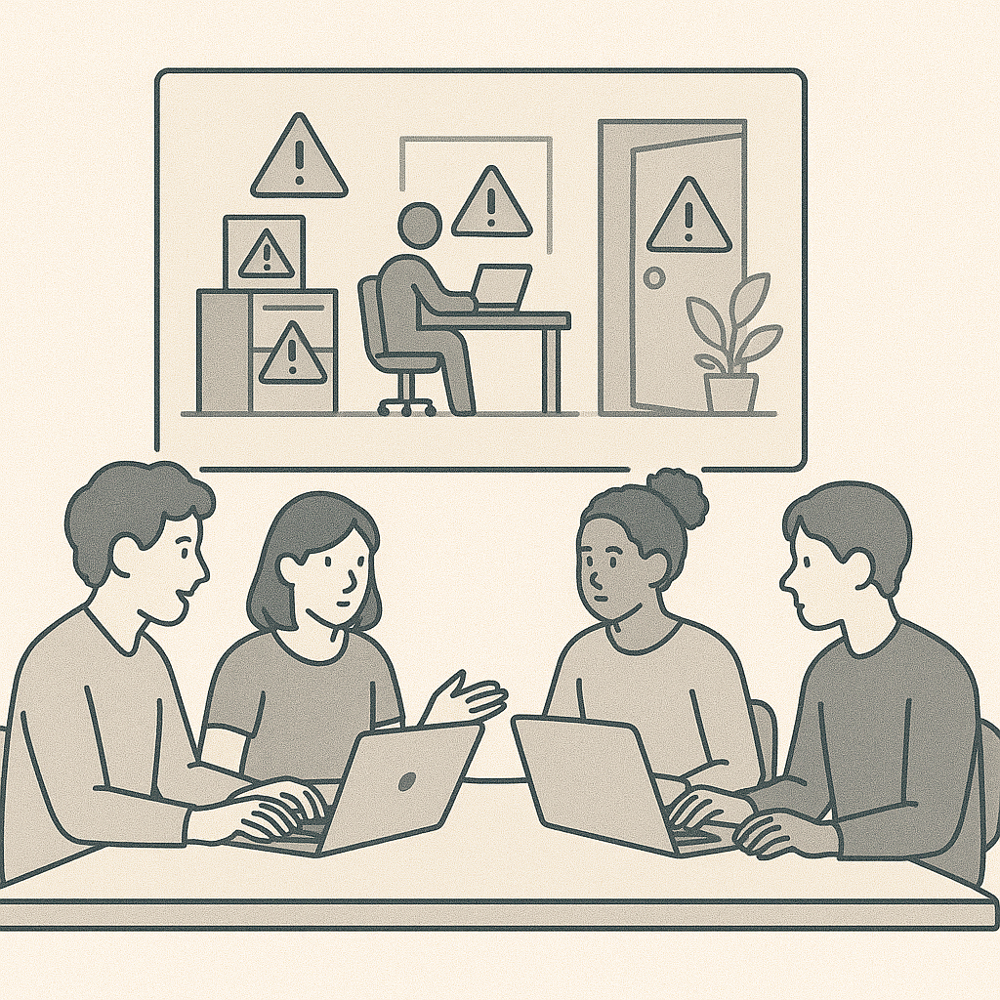

# Lab 2 — Cyber Hygiene Challenge

## Objective
Practice basic cyber hygiene tasks and identify teaching opportunities.

## Tasks (Instructor may demo or assign)

Choose 3–5:
- Identify weak vs strong passwords
- Enable or verify MFA on an account
- Check system update status
- Perform a simple backup and restore
- Review browser extensions for risk

## Reflection Questions
- Which tasks could students perform independently?
- Which tasks require institutional coordination?
- How would you assess student understanding?

## Extension
Advanced participants may design a grading rubric
or adapt tasks for enterprise environments.
