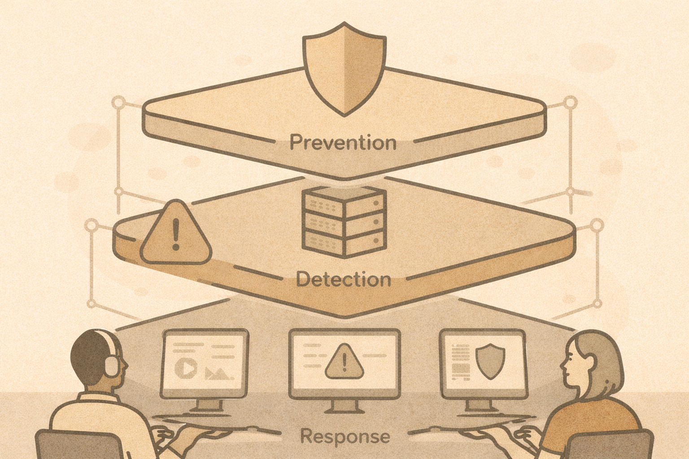

# Defensive Security Fundamentals (Blue Team View)

## Big idea
Defensive security is about **reducing uncertainty**.

Attackers only need to succeed once.
Defenders must notice problems quickly and respond well.

## Prevention vs detection vs response

- **Prevention**: stop bad things from happening
- **Detection**: notice when something suspicious happens
- **Response**: limit damage and recover

No organization gets prevention perfect.
Detection and response are what limit real-world damage.

## What “good defense” looks like
Good defense does **not** mean:

- zero alerts
- zero incidents
- perfect tools

Good defense **does** mean:

- knowing what systems exist
- knowing what “normal” looks like
- noticing meaningful changes
- responding consistently

## Common beginner misconception
> “We have antivirus / a firewall / MFA, so we’re secure.”

Security controls reduce risk.
They do not eliminate it.

## Visibility comes first
Before choosing tools, defenders ask:

- What data do we collect?
- Where does it come from?
- Who reviews it?
- What happens when something looks wrong?

## Quick activity
Write down:

- Three things you would want to know during a security incident
- Where that information might come from
