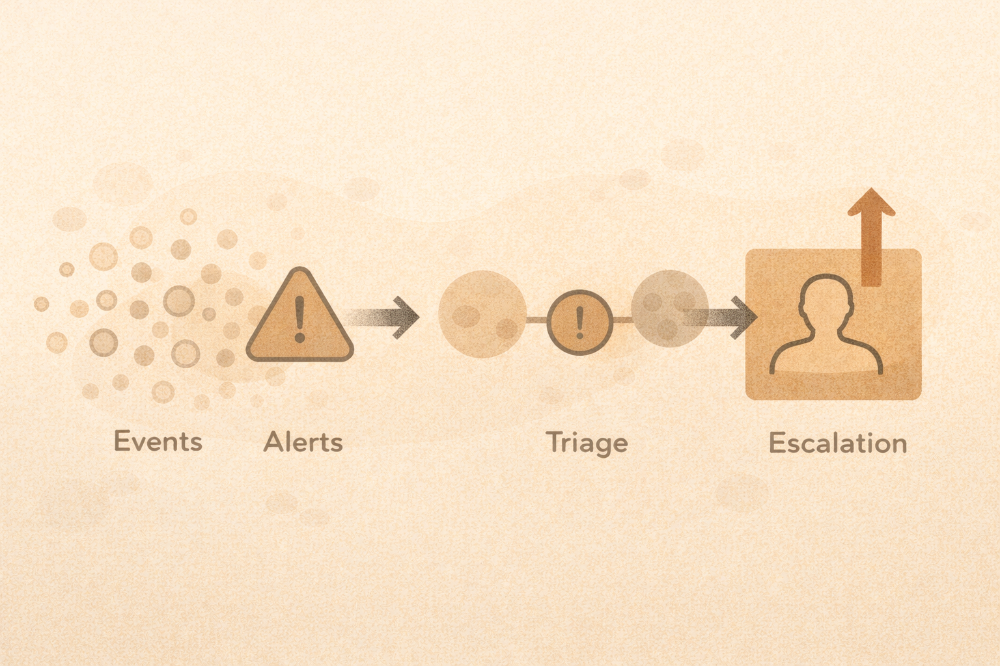

# Threat Detection Workflow (Signal vs Noise)

## How detection actually works
Detection is a process, not a single alert.

Most environments follow this flow:

**Events → Alerts → Triage → Escalation**

## Events
An **event** is something that happened.
Examples:

- a login attempt
- a process starting
- a file being accessed
- a network connection opening

Most events are normal.

## Alerts
An **alert** is an event that someone thinks *might* matter.
Alerts are guesses — not confirmations.

## Triage
**Triage** answers:

- Is this real?
- Is it expected?
- Does it need action?

Most alerts are closed during triage.

## Escalation
Escalation happens when:

- risk is confirmed
- impact is possible
- further response is required

## Signal vs noise

- **Noise**: normal or low-risk activity
- **Signal**: meaningful deviation from normal

Too much noise = missed signals  
Too little data = blind spots  

## Activity
For each example, decide:

- noise
- signal
- needs more context

1. Failed login followed by success from same device
2. Login from a new country
3. Antivirus detects a known test file
4. Multiple MFA prompts reported by a user
