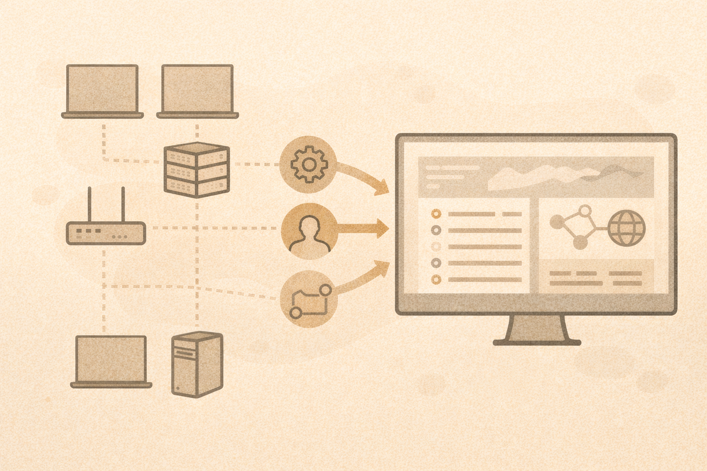

# Endpoint and Network Visibility

## What “endpoint” means
An endpoint is a device:

- laptop
- desktop
- server
- virtual machine

Endpoints are where most attacks become visible.

## What endpoint tools can see
Endpoint visibility often includes:

- running processes
- file activity
- network connections
- user authentication behavior

This data is called **telemetry**.

## What endpoint tools cannot do
They cannot:

- read intent
- prevent all attacks
- fix bad permissions
- replace backups

Tools assist humans — they do not replace judgment.

## Network visibility
Network data can show:

- who is talking to whom
- when connections happen
- unusual destinations
- DNS requests

Common sources:

- firewall logs
- DNS logs
- flow data

## Key takeaway
Data does not equal detection.
Detection happens when someone:

- reviews
- correlates
- understands the context

## Activity
Match the behavior to a likely data source:

- suspicious process execution
- unusual DNS request
- repeated login failures
