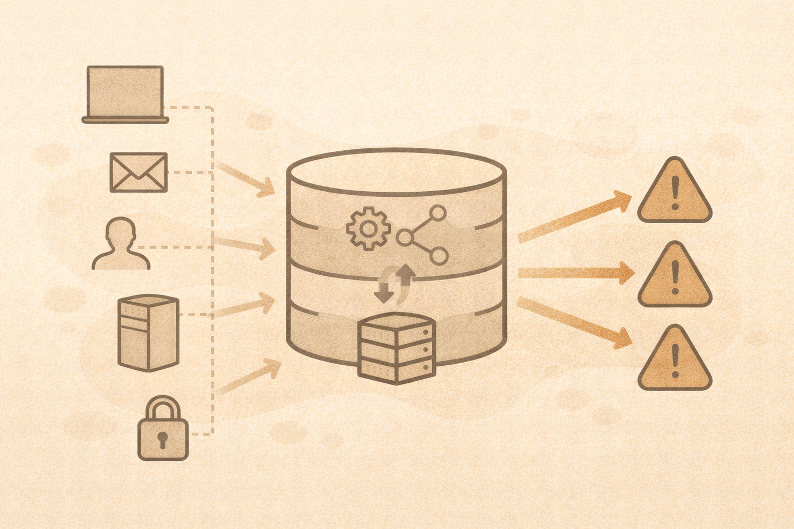

# SIEM Concepts (Without Needing a Tool)

## What a SIEM is
A SIEM (Security Information and Event Management system):

- collects logs
- normalizes data
- correlates events
- generates alerts

## Normalization
Different systems log differently.
Normalization makes logs comparable.

Example:

- Windows login
- Linux login
- Cloud login

Different formats, same idea.

## Correlation
Correlation looks for patterns:

- failed login + success
- login + unusual location
- process start + network beacon

Single events may not matter.
Patterns do.

## Teaching SIEM thinking
You do not need Splunk or Sentinel to teach this.

You can use:

- printed log snippets
- spreadsheets
- whiteboards
- small datasets

## What matters most

- asking good questions
- understanding context
- recognizing patterns

## Activity
Given three log entries:

- Which matter alone?
- Which matter together?
- Which can be ignored?
