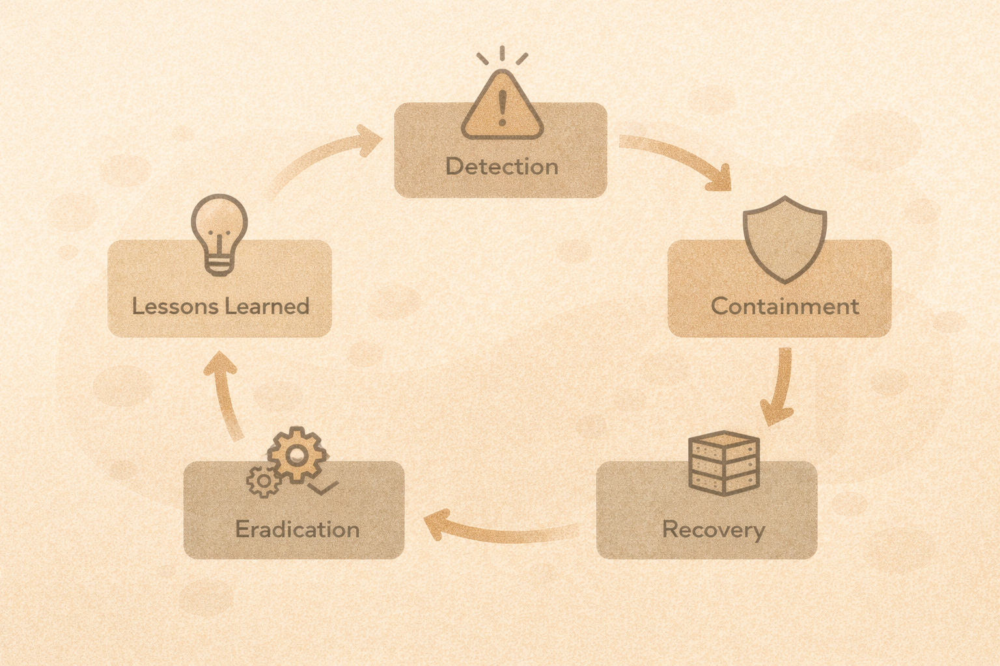

# Incident Response Basics

## Why incident response matters
Incidents will happen.
Response determines impact.

## Common response roles

- Technical responder
- Decision maker
- Communicator / documentation lead

One person may fill multiple roles.

## Incident response phases

1. Preparation
2. Detection
3. Containment
4. Eradication
5. Recovery
6. Lessons learned

## First actions matter
In the first minutes:

- write down what you know
- preserve evidence
- avoid panic changes

Fixing too fast can destroy evidence.

## Evidence basics
Evidence includes:

- logs
- timestamps
- screenshots (when appropriate)
- system state

Document as you go.

## Activity
Walk through this scenario:
A user reports suspicious login alerts.

Answer:

- what is the risk?
- what evidence do you collect?
- what does containment look like?
