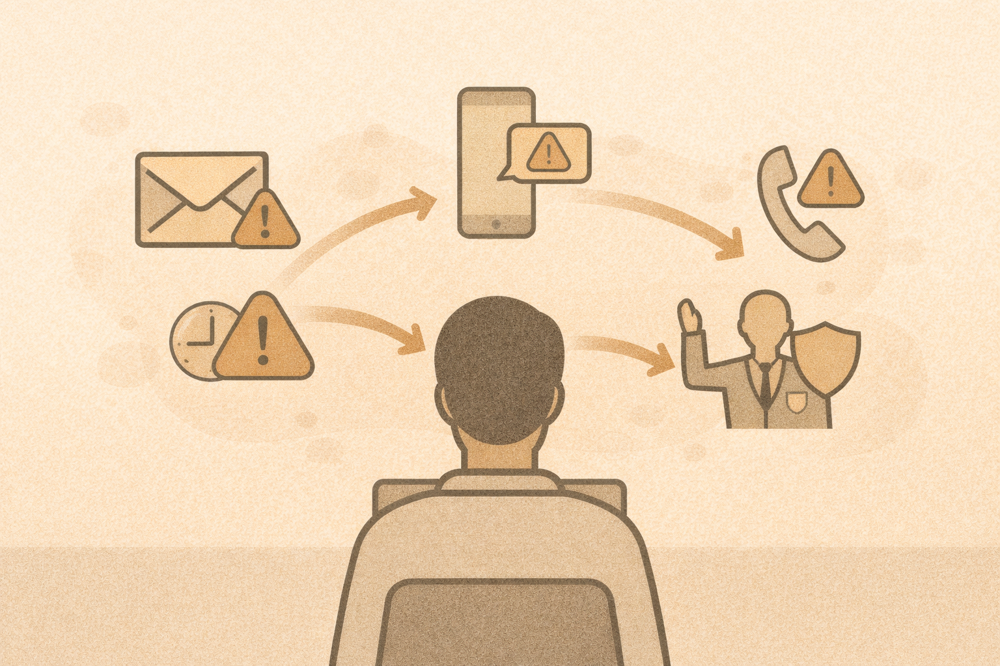

# Social Engineering Deep Dive

## Why social engineering works
It targets:

- trust
- authority
- urgency
- fear
- helpfulness

Technical defenses cannot fully stop human manipulation.

## Common techniques

- phishing (email)
- smishing (text)
- vishing (voice)
- pretexting (fake story)
- MFA fatigue

## Advanced patterns

- fake internal support calls
- impersonated vendors
- “quick favor” requests
- urgent policy violations

## Teaching responsibly
Focus on:

- recognizing patterns
- verifying requests
- reporting early

Avoid:

- real brand impersonation
- humiliating examples

## Activity
For each scenario:

- identify the psychological lever
- identify a safe response
