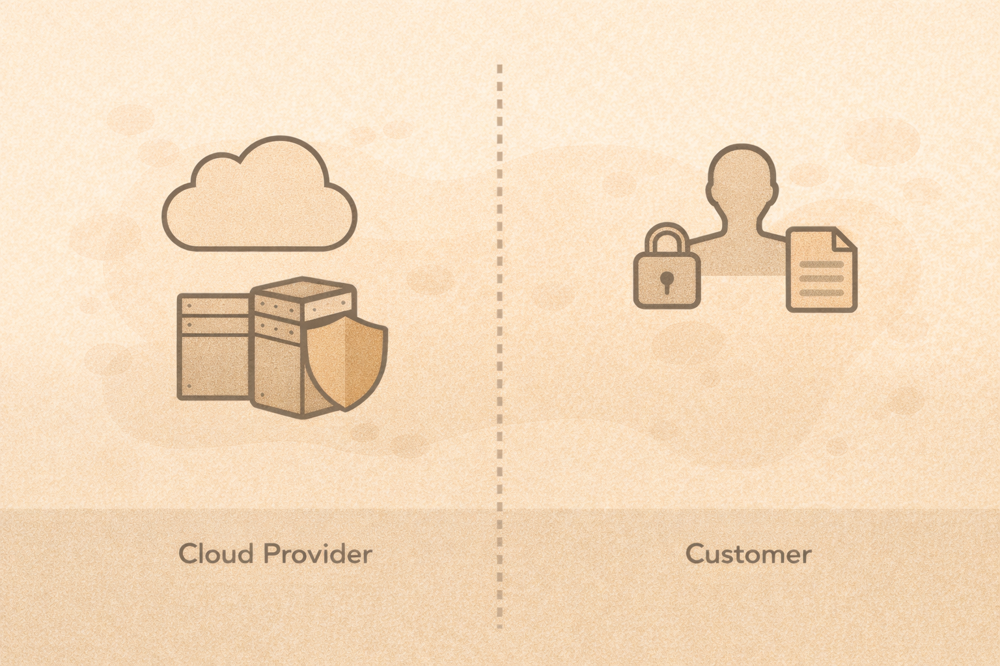

# Cybersecurity and Cloud Basics

## Cloud does not mean secure by default
Cloud security depends on configuration.

## Shared responsibility model
The provider handles:

- physical infrastructure
- underlying hardware

The customer handles:

- identities
- permissions
- configurations
- data protection

## Identity-first security
In the cloud:

- identity is the perimeter
- permissions are powerful
- misconfigurations are common

## Common cloud failures

- public storage
- excessive permissions
- exposed APIs
- unused credentials

## Key idea
Security failures in the cloud are usually configuration failures.

## Activity
Decide who is responsible:

- exposed storage bucket
- stolen credentials
- physical server failure
