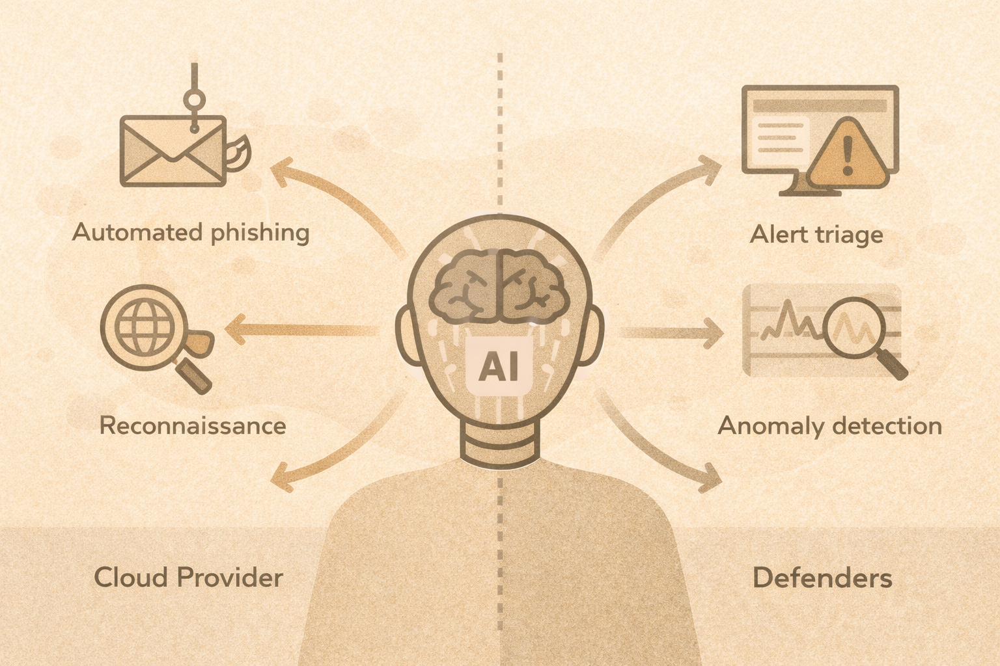

# AI’s Impact on Cybersecurity

## AI as a force multiplier
AI increases speed and scale — for both sides.

## Attacker uses

- phishing content generation
- reconnaissance
- malware assistance

## Defender uses

- alert summarization
- triage assistance
- anomaly detection
- report generation

## Limitations
AI can:

- hallucinate
- miss context
- amplify bias

Humans remain accountable.

## Safe use principles

- assist, not decide
- verify outputs
- document decisions

## Activity
Categorize tasks:

- AI should assist
- humans must decide
