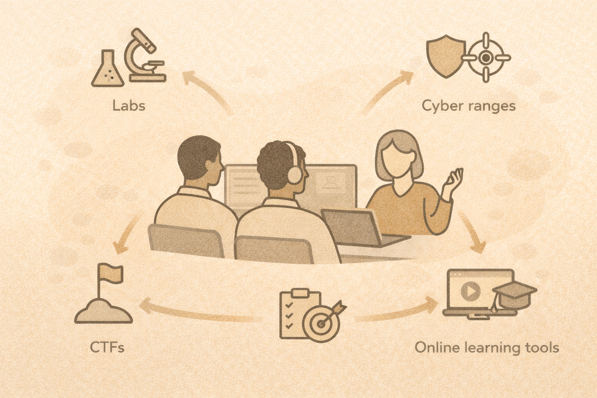

# Teaching Platforms and Resources

## Match tools to outcomes
Choose platforms based on:

- time available
- learning goals
- student experience

## Common options

- NDG / NetLab+
- cyber ranges
- TryHackMe
- CTF platforms
- local Docker labs

## Tradeoffs
More tools ≠ better learning.

One well-used platform beats many unused ones.

## Teaching guidance

- start small
- scaffold difficulty
- emphasize reflection

## Activity
Choose a platform for:

- 1-week module
- 4-week course
- capstone project
