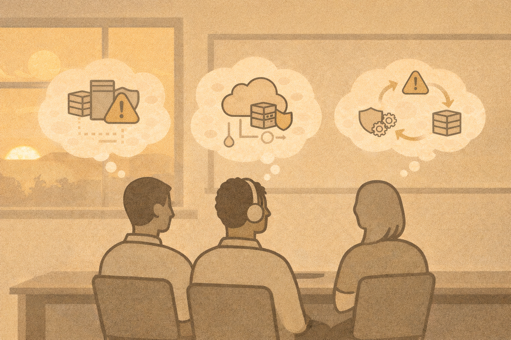

# Day 2 Wrap-Up

## What you learned today
You explored:

- defensive security thinking
- detection workflows
- endpoint and network visibility
- SIEM concepts
- incident response basics
- social engineering patterns
- cloud security fundamentals
- AI’s role in cybersecurity

## Key takeaway
Defense is about:

- visibility
- judgment
- response

Tools support thinking — they do not replace it.

## Exit reflection
Answer briefly:

1. One concept that clicked today
2. One area you want more practice with
3. One defensive control you understand better now

Tomorrow, we will focus on **hands-on application and teaching these concepts effectively**.
