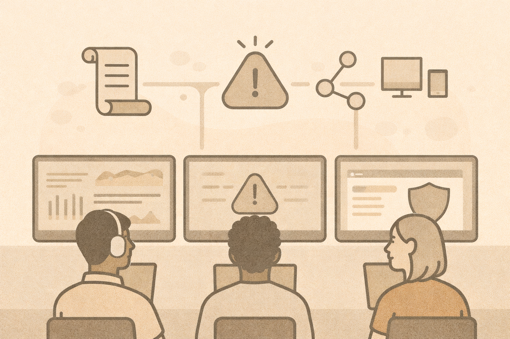

# Day 2 — Defensive Security, Detection, and Response

## What today is about
Day 2 focuses on how defenders actually operate in the real world.

Instead of starting with tools, we start with **visibility**:

- How do you know what is happening?
- How do you recognize problems early?
- How do you respond in a structured way?

## By the end of today, you will be able to:

- Explain what “good” defensive security looks like
- Describe how detection workflows operate
- Understand endpoint, network, and log visibility
- Explain SIEM concepts without relying on specific tools
- Walk through a basic incident response process
- Recognize advanced social engineering techniques
- Explain cloud security basics and shared responsibility
- Discuss how AI affects both attackers and defenders

## How today will work

- Short concept lessons
- Scenario-based discussion
- Hands-on labs (via the Lab Hub)
- Reflection on how these ideas can be taught in class

## Quick recap (from Day 1)
Answer these mentally before continuing:

- What is the CIA Triad?
- What is risk?
- What is the difference between a threat and a vulnerability?
- Why does visibility matter in security?

If those feel fuzzy, that’s okay — today will reinforce them.
