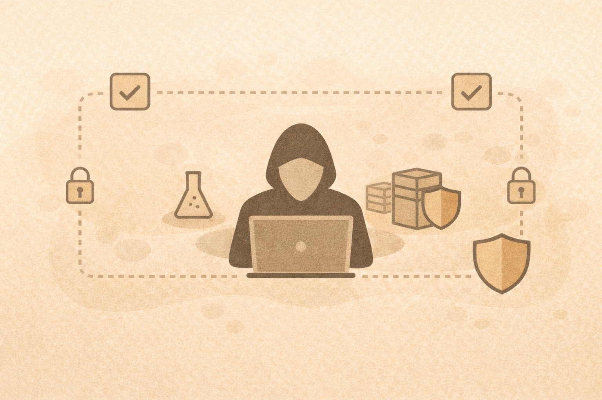

# Offensive Security for Beginners (Ethical Framing)

## Why teach offensive security?
Offensive techniques help defenders:

- understand attacker thinking
- identify weak points
- prioritize defenses
- respond more effectively

## Ethical foundations
Offensive security must include:

- authorization
- defined scope
- rules of engagement
- clear learning objectives

## What students should never do

- target real systems without permission
- collect real credentials
- “try things out” on live networks
- imitate real scams or brands

## Safe teaching approach

Teach offense as:

- analysis
- controlled simulation
- reasoning exercises
- approved lab environments only

## Key message to students
> “We study how attacks work so we can stop them.”

## Activity
Write one sentence you would use to explain ethical hacking to your students.
