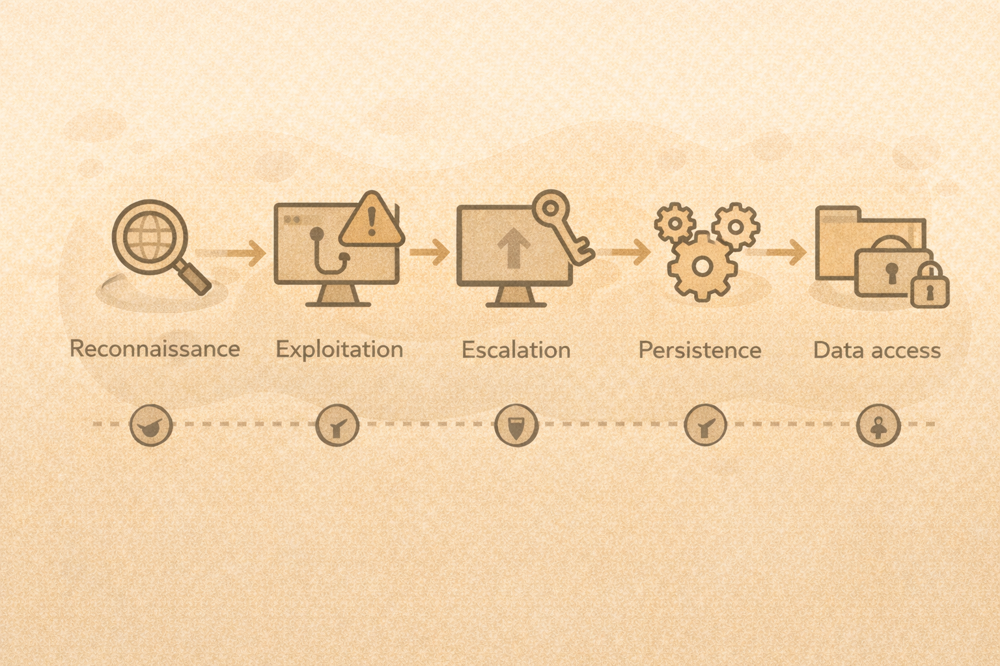

# Reconnaissance and the Attack Chain

## The attacker’s high-level process
Most attacks follow a similar chain:

1. Identify
2. Enumerate
3. Exploit
4. Escalate
5. Persist
6. Exfiltrate

## Mapping attacks to CIA
Each step impacts:

- Confidentiality
- Integrity
- Availability

Example:

- credential theft → confidentiality
- data modification → integrity
- ransomware → availability

## Defender advantage
Knowing the chain helps defenders:

- detect earlier
- break the chain
- reduce impact

## Teaching tip
Focus on **patterns**, not tools.

## Activity
Pick one attack step and answer:

- What might defenders see?
- Which CIA element is at risk?
- Which control could interrupt it?
