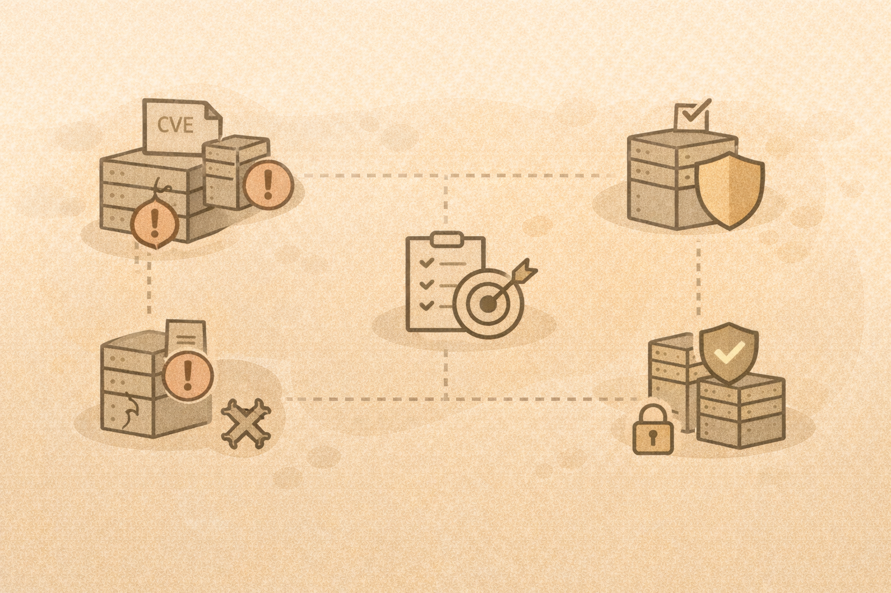

# Vulnerability Basics

## What a vulnerability is
A vulnerability is a weakness that can be exploited.

Not all vulnerabilities lead to incidents.

## CVEs (high level)

- Common Vulnerabilities and Exposures
- Publicly documented issues
- Severity does not equal risk

## Risk vs severity
Risk depends on:

- likelihood
- impact
- exposure
- environment

## Configuration vs vulnerability
Many incidents are caused by:

- misconfiguration
- excessive permissions
- poor defaults

## Patching realities

- patching takes time
- testing matters
- prioritization is essential

## Activity
Given three vulnerabilities, decide:

- which to patch first
- why
