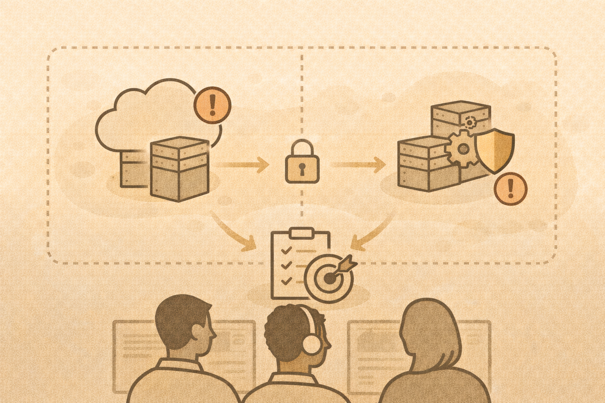

# Cloud and Container Security (Intro)

## Why cloud security is different

- identity is the perimeter
- misconfiguration is common
- automation amplifies mistakes

## Common cloud failures

- public storage
- over-permissioned roles
- exposed APIs
- unused credentials

## Container basics
Containers package:

- application
- dependencies
- runtime

## Container security concerns
- secrets in images
- outdated base images
- excessive privileges
- untrusted sources

## Teaching approach
Focus on:

- least privilege
- image hygiene
- configuration awareness

## Activity
Identify one cloud or container mistake and its likely impact.
