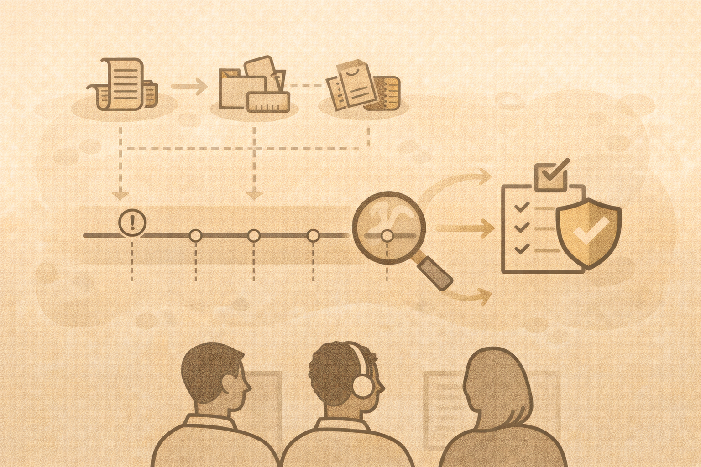

# Digital Forensics Foundations

## Core question
> “What happened?”

## Forensic thinking
Forensics focuses on:

- timelines
- evidence
- reconstruction

## Common evidence sources

- logs
- file metadata
- memory artifacts
- system state

## Tools (conceptual)

- Autopsy (disk analysis)
- Volatility (memory analysis)

Understanding **why** tools are used matters more than mastery.

## Teaching guidance

- emphasize methodology
- avoid “magic tool” thinking

## Activity
Given an incident, list:

- evidence sources
- timeline questions
