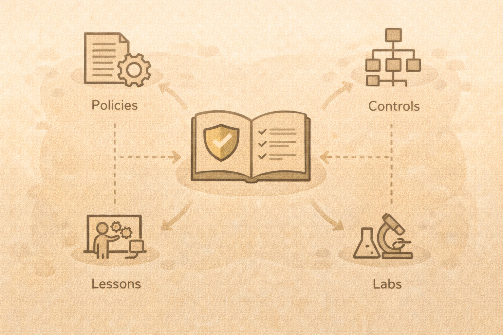

# Frameworks and Governance (Teacher-Friendly)

## Why frameworks exist
Frameworks provide:

- shared language
- structure
- consistency

## Common frameworks

- NIST Cybersecurity Framework
- NIST 800-61 (Incident Response)
- CIS Controls
- NICE Workforce Framework

## Teaching frameworks
Translate frameworks into:

- learning objectives
- labs
- checklists

Avoid teaching frameworks as memorization exercises.

## Example
Framework control → classroom activity → lab deliverable

## Activity
Pick one framework concept and turn it into:

- a lesson
- a lab task
