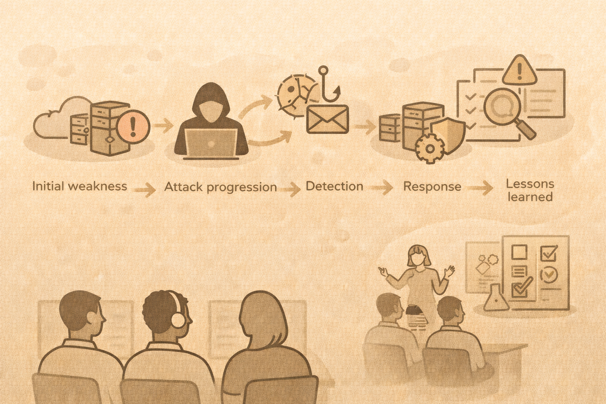

# Capstone Integration

## Purpose
The capstone ties everything together:

- CIA
- hygiene
- detection
- response
- ethical offense

## Narrative-based approach
Use a single scenario:

- initial weakness
- attacker progression
- detection signals
- response decisions

## Student deliverables

- threat analysis
- detection plan
- response checklist
- lessons learned

## Teaching benefit
Students see security as a **system**, not silos.

## Activity
Sketch a capstone scenario you could reuse every semester.
