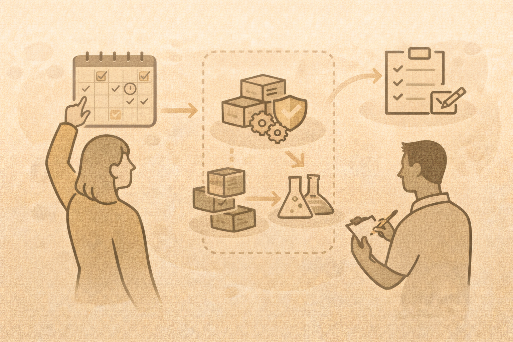

# Implementation Planning

## Bringing this back
Focus on:

- your student audience
- time constraints
- institutional policies

## Module sequencing

- foundations first
- detection before offense
- offense tied to defense

## Assessment ideas

- pre/post assessments
- scenario-based questions
- lab reflections

## Lab packaging strategy

- reusable labs
- clear objectives
- safe environments

## Activity
Write your next steps:

- first topic you will teach
- one lab you will use
- one change you will make
