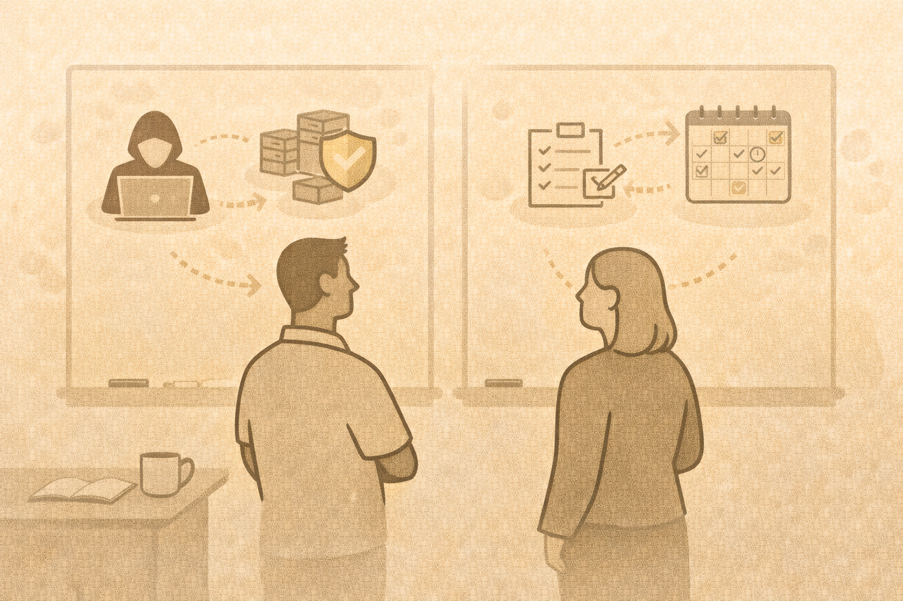

# Day 3 Wrap-Up

## What you’ve built
You now have:

- a complete beginner cyber curriculum
- ethical offensive framing
- detection and response workflows
- safe lab models
- a reusable capstone
- an implementation plan

## Final reflection
Answer briefly:

1. What are you most confident teaching?
2. What support do you still need?
3. What is one thing you will do differently in your classroom?

## Thank you
These materials are designed to be adapted, reused, and improved.

Teach responsibly. Teach clearly. Teach with purpose.
