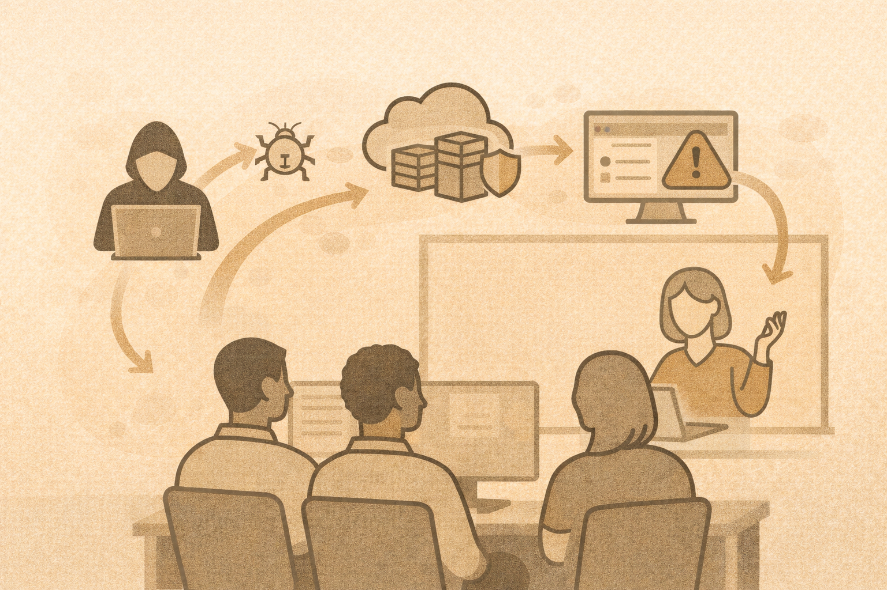

# Day 3 — Offensive Concepts, Integration, and Teaching Strategy

## What today is about
Day 3 brings everything together.

You will explore offensive security concepts **ethically and safely**, connect attacks back to defensive controls, and build a complete teaching narrative you can reuse in your own courses.

## By the end of today, you will be able to:

- Explain offensive security responsibly
- Describe the full attack chain and its impacts
- Teach vulnerability concepts without tool overload
- Run safe attack/defend classroom exercises
- Introduce cloud, container, and forensic concepts
- Translate frameworks into lessons and labs
- Design a reusable capstone scenario
- Plan how to implement this workshop in your environment

## Key reminder
Offensive security is studied to **improve defense**, not to cause harm.

Everything today stays within ethical, authorized boundaries.
